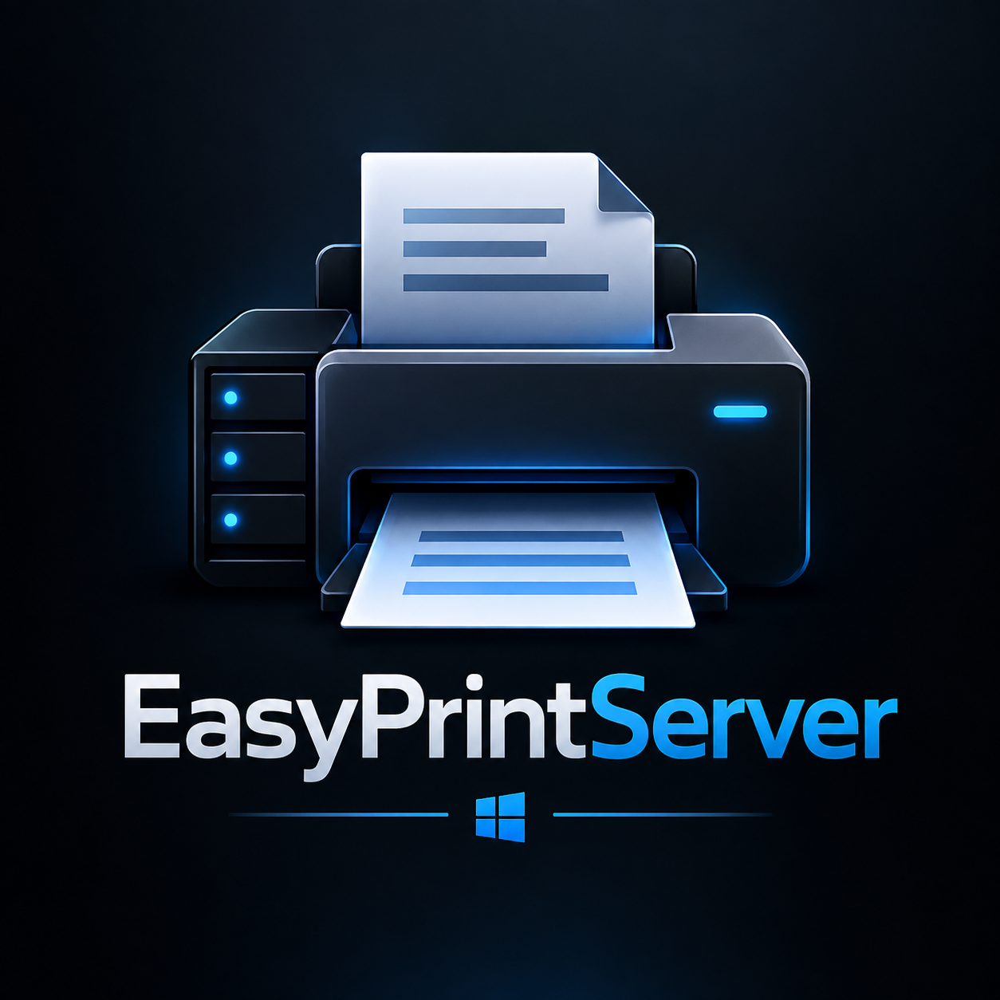

<p align="center">
  
</p>

<h1 align="center">EasyPrintServer</h1>

<p align="center">
  <strong>Windows print server deployment without the repetitive setup.</strong>
</p>

<p align="center">
  A Windows-based setup wizard designed to simplify printer creation, sharing, driver installation, and deployment in Active Directory environments.
</p>

---

## 🖨️ Overview

EasyPrintServer was built to simplify one of those Windows administration jobs that can become unnecessarily repetitive: deploying and configuring a print server.

Instead of manually working through printer creation, driver installation, sharing, and deployment configuration, EasyPrintServer provides a guided interface for handling the process from one place.

The goal is simple:

> **Spend less time clicking through print management and more time wondering why printers still exist.**

---

## ✨ Features

- 🖨️ Guided printer creation and configuration
- 📦 Printer driver installation using INF packages
- 🌐 Automatic printer sharing
- 🏷️ Configurable printer names and share names
- 🖥️ Windows print server configuration
- 🏢 Designed for Active Directory environments
- ⚙️ Group Policy / logon deployment support
- 📜 PowerShell-assisted administration
- 🧭 Wizard-style interface for repeatable deployments
- 🔧 Built for real-world IT administration

---

## ⚙️ How It Works

EasyPrintServer guides the administrator through the major pieces of a Windows printer deployment:

```text
                 ┌─────────────────────┐
                 │   EasyPrintServer   │
                 └──────────┬──────────┘
                            │
              ┌─────────────┼─────────────┐
              │             │             │
              ▼             ▼             ▼
       Printer Setup   Driver Install   Print Sharing
              │             │             │
              └─────────────┼─────────────┘
                            │
                            ▼
                 Windows Print Server
                            │
                            ▼
                Active Directory / GPO
                            │
                            ▼
                     Client PCs
```

This creates a more consistent deployment process and reduces the amount of repetitive configuration required when rolling out printers across a Windows domain.

---

## 🛠️ Built With


**Language:** C#  
**Interface:** WPF  
**Platform:** Windows  
**Environment:** Active Directory / Windows Server  
**Automation:** PowerShell & Windows administration tools

---

## 🧩 Deployment Workflow

A typical deployment follows this process:

1. **Configure the print server**
   - Prepare the Windows server that will host shared printers.

2. **Add printer drivers**
   - Select and install the appropriate printer driver package.

3. **Create the printer**
   - Configure the printer name, port, IP address, and driver.

4. **Share the printer**
   - Publish the printer using a standardized network share.

5. **Configure deployment**
   - Prepare the printer for deployment to domain users or computers.

6. **Deploy to clients**
   - Use Active Directory Group Policy or logon-based deployment to make printers available automatically.

---

## 🏢 Why I Built It

Print server deployments often involve repeating the same administrative steps across multiple printers:

- Creating TCP/IP ports
- Installing drivers
- Creating printer queues
- Configuring share names
- Sharing printers
- Preparing deployment
- Configuring client installation

EasyPrintServer was created to bring those tasks into a more straightforward workflow.

Rather than treating every printer deployment as a collection of separate administrative tasks, the project turns the process into a guided setup experience.

---

## 📁 Project Structure

```text
EasyPrintServer/
│
├── EasyPrintServer/       # Application source
├── assets/                # Project artwork and documentation assets
├── EasyPrintServer.slnx   # Visual Studio solution
└── README.md
```

The application source contains the WPF interface and the logic used to perform Windows print server configuration and deployment tasks.

---

## 💻 Requirements

EasyPrintServer is intended for Windows environments and requires appropriate administrative access for the operations being performed.

Typical deployment environments include:

- Windows Server
- Active Directory
- Group Policy
- Windows client systems
- Network printers
- Administrative privileges

Printer manufacturers may require their own driver packages before deployment.

---

## 🚧 Project Status

EasyPrintServer is an ongoing project.

Additional improvements may include expanded driver management, deployment options, validation, logging, and other administrative features.

---

## 🤝 Contributing & Support

Contributions, suggestions, and bug reports are welcome.

- 🐛 Found a bug? Open an **Issue**
- 💡 Have an idea? Submit a **feature request**
- 🔧 Want to improve something? Pull requests are welcome

If EasyPrintServer saves you from spending an afternoon manually configuring printers, consider giving the repository a ⭐.

---

## 👨‍💻 About

Built by **r00t-Sicco** as a project focused on Windows administration, automation, and making repetitive IT work considerably less repetitive.

> *Printers break. EasyPrintServer tries to make that someone else's problem.*
